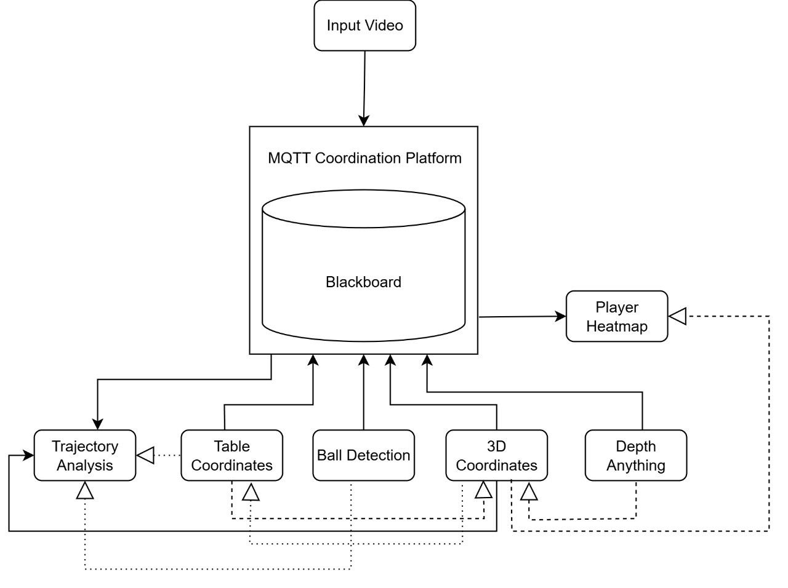
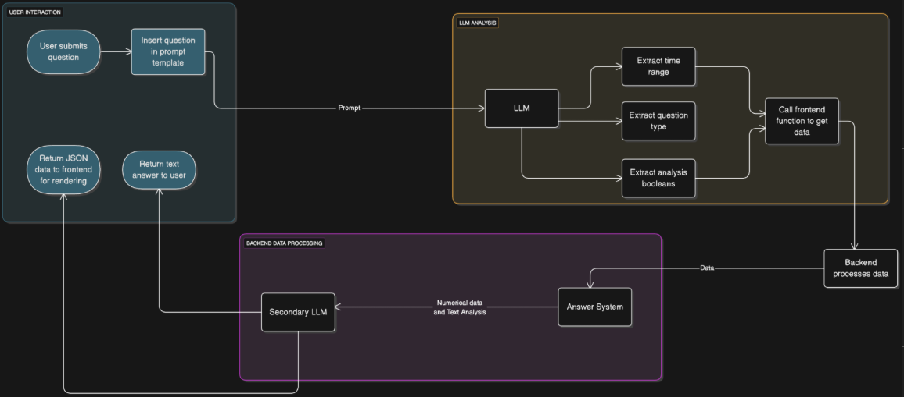

# Synopsis

The reasoning models presently rely a lot on LLMs and LLM agents taking various roles. This has its advantages, but it requires a large number of tokens and computation. There are also other non-LLM based ways that provide intelligence such as various ML models that are specialized.

LLM based systems are not very explainable, because at their core they do not rely on numerical data or reasoning. The next step of intelligence is trustable, reliable reasoning based on data. To do this we need to create a mechanism for reasoning that a system can follow to
reach a conclusion based on facts

Currently there are specialized ML systems for individual problems, but for a more advanced system, these individual components cannot be treated as the final solution but instead as a stepping stone to greater insights. Multiple such components have to be integrated into a single
framework where each component can act independently towards a common goal.

The architecture in this project facilitates flexible integration of diverse analysis components and minimizes redundant computation. A shared context layer aggregates module outputs for access by other components and as an external interface for querying data. We also build a semi-agentic retrieval augmented generation system that can call on specific components to process the required data for further insights.

We demonstrate the applicability of the system in the domain of sports video analysis, using table tennis match footage as a case study. The proposed design generalizes well to other domains that require fine-grained and interpretable video understanding.

# Architecture

The architecture consists of the following components:
1. **Modular Analysis Components**: Independent modules that perform specialized analysis tasks (e.g., object detection, action recognition, event detection). Each module processes the input video and generates structured outputs.
2. **MQTT Server**: A lightweight messaging broker that facilitates communication between the modular analysis components and the blackboard. Every module subscribes to relevant topics and can be activated by other modules or the blackboard as needed. **This is the brain of the system that ensures decoupled and efficient interaction among components.**
3. **Blackboard**: A shared context layer that aggregates outputs from all analysis components. The blackboard serves as a centralized repository of information, allowing other modules and systems to access and query the aggregated data efficiently.

4. **Semi-Agentic RAG System**: A retrieval-augmented generation system that can intelligently query the blackboard and invoke specific analysis components as needed. This system uses LLMs to generate insights based on the aggregated data while minimizing token usage by leveraging pre-computed module outputs.

